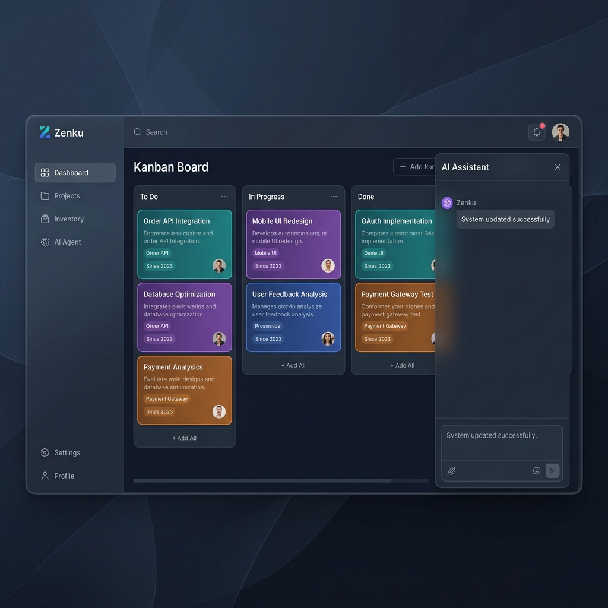
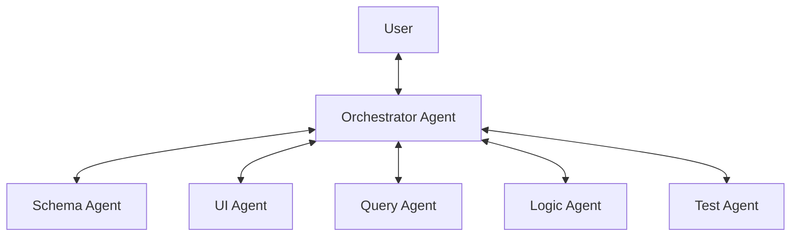

# Zenku

### **Build Production-Ready Data Apps via Conversation.**

[繁體中文](README_TW.md) | [Documentation](docs/en/README.md)

<div align="center">
  
</div>

**Zenku** is an AI-first, open-source **No-Code Engine** designed for building enterprise-grade data applications. Instead of generating static code, Zenku uses a sophisticated **Multi-Agent Architecture** to dynamically evolve your database schema, UI views, and business logic in real-time through natural language.

* **Chat-to-App Workflow**: Transform "I need a CRM" into a live system (Schema -> CRUD UI -> Dashboard) in seconds.
* **Specialist Agent System**: Dedicated agents for Schema, UI, Logic, Query, and Testing, coordinated by a central Orchestrator.
* **Enterprise DB Support**: Native support for **SQLite**, **PostgreSQL**, and **Microsoft SQL Server (MSSQL)**.
* **Versatile View Engine**: Dynamic rendering for **Kanban**, **Gantt**, **Calendar**, **Timeline**, **Dashboard**, and more.
* **Real-time Logic**: A powerful Business Rules Engine for automation, validation, and third-party webhooks (e.g., n8n).
* **Reliability & Undo**: A built-in **Design Journal** acting as a "Time Machine," allowing you to undo any AI change instantly.
* **MCP Ready**: Full **Model Context Protocol** support, enabling external AI tools to control your Zenku instance.

## 🧠 Architecture: The Multi-Agent Orchestrator

Unlike simple "Code Gen" wrappers, Zenku separates reasoning from execution through specialized roles:



## 🏗️ Architecture

Zenku uses a Monorepo (`npm workspaces`) structure:

### 1. `@zenku/server` (The Brain)
* **Stack**: Node.js + Express + TypeScript
* **Database Layer**: Robust Adapter pattern for switching between production-grade databases.
* **Orchestrator**: Coordinates specialized LLM Tool Agents:
  * `schema-agent` (DDL & Schema Management)
  * `ui-agent` (View Definition & Layout)
  * `query-agent` (Natural Language to SQL)
  * `logic-agent` (Automation Rules & Guardrails)

### 2. `@zenku/web` (The Interpreter)
* **Stack**: React 19 + Vite + Tailwind CSS + shadcn/ui
* **Dynamic Rendering**: Composed of highly abstract components (`TableView`, `FormView`, `GanttView`) that render instantly based on JSON definitions.

### 3. `@zenku/shared` (Common Ecosystem)
* Strictly maintained TypeScript definitions, Formula calculation engine, and Appearance logic parser.

## 🚀 Quick Start

### 1. Developer Setup

1. **Install Dependencies**:
   ```bash
   git clone https://github.com/antonylu0826/zenku-v2.git
   cd zenku
   npm install
   ```

2. **Configure Environment**:
   Copy `.env.example` to `.env` and fill in your API Key and DB credentials:
   ```bash
   # Example: Switch to MSSQL
   DB_TYPE=mssql
   DB_HOST=localhost
   DB_USER=sa
   DB_PASSWORD=YourPassword
   ```

3. **Launch**:
   ```bash
   npm run dev
   ```
   Visit `http://localhost:5173` to start.

### 2. One-Click Docker Deployment
```bash
docker-compose up -d
```

---

### 3. Build Your First App in 5 Minutes

*   **Project Management**:  
    `"Create a project tracking system with name, progress, start and end dates, and generate a Gantt chart view for me."`
*   **Automation & Validation**:  
    `"In the order form, if stock is less than demand, prevent saving and show an 'Insufficient Stock' warning."`
*   **Workflow Integration**:  
    `"When a new order is created, trigger a webhook to my n8n workflow."`

---

Zenku aims to unleash your creativity by turning complex development into a simple, fun conversation. **Happy Building!** 🚀

## 📚 Documentation

For more technical details and implementation guides, please refer to our official documentation:

*   **[English Documentation](docs/en/README.md)**: Includes core concepts, architecture design, functional specs, and n8n integration guides.
*   **[繁體中文文檔](docs/zh-TW/README.md)**: Conceptual overview, system architecture, and API references in Traditional Chinese.

## 📄 License

This project is licensed under the [GPL v3 License](LICENSE).
