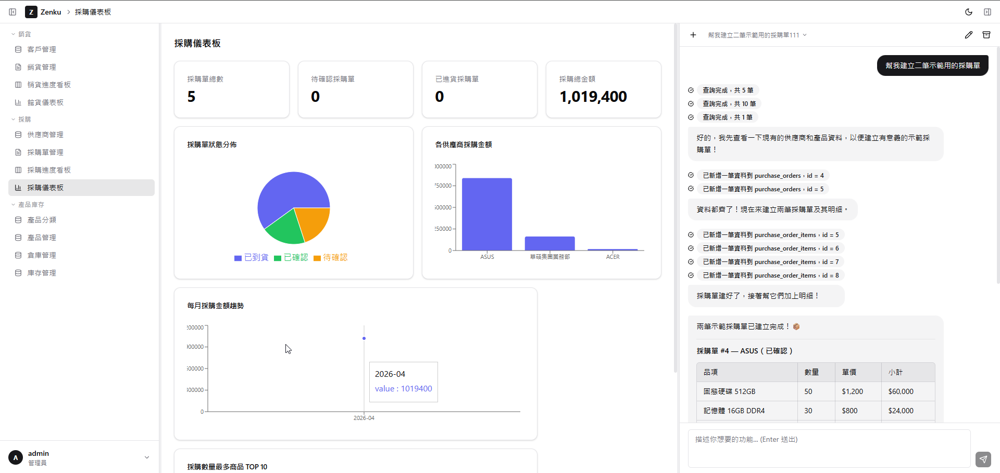
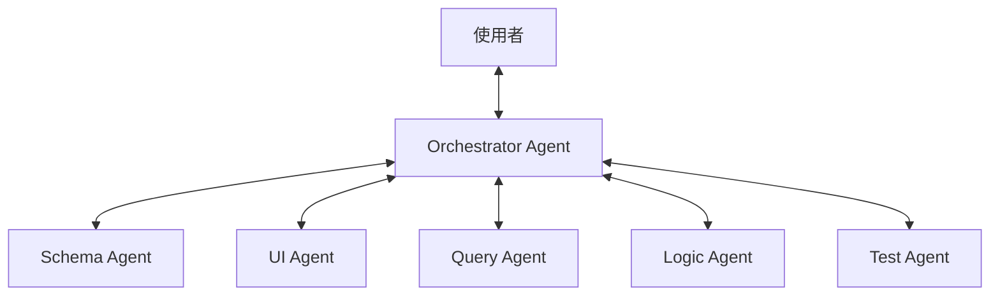

# Zenku

### **透過對話，建立具備生產力的資料應用。**

[English](README.md) | [官方文件](docs/zh-TW/README.md)

<div align="center">
  
</div>

**Zenku** 是一個 AI 原生、開源的 **無程式碼 (No-Code) 引擎**，專為建構企業級資料應用而生。不同於單純生成靜態程式碼的工具，Zenku 採用先進的 **多智能體架構 (Multi-Agent Architecture)**，能透過自然語言即時演化您的資料庫綱要、UI 視圖與商業邏輯。

* **對話即開發 (Chat-to-App)**：將「我要一個 CRM」轉化為運作中的系統（Schema -> CRUD 介面 -> 儀表板）。
* **專職代理人系統 (Specialist Agents)**：由 Orchestrator 調度 Schema, UI, Logic, Query 與測試代理。
* **企業級多資料庫支援**：原生支援 **SQLite**, **PostgreSQL** 與 **Microsoft SQL Server (MSSQL)**。
* **全能視圖引擎**：動態渲染 **看板**, **甘特圖**, **行事曆**, **時間軸**, **數據儀表板**等。
* **即時商業邏輯**：強大的規則引擎，支援自動化、資料驗證與第三方 Webhook (如 n8n)。
* **高可靠性與 Undo**：內建**設計日誌**充當時光機，支援一鍵還原任何 AI 變更。
* **支援 MCP 協議**：完整支援 **Model Context Protocol**，讓外部 AI 工具能直接操控 Zenku 實例。

## 🧠 架構：多智能體調度中心

不同於簡單的「代碼生成」包裝，Zenku 透過專職角色實現思考與執行的分離：



## 🏗️ 系統架構 (Architecture)

本專案採用 Monorepo (`npm workspaces`) 架構：

### 1. `@zenku/server` (後端大腦)
* **核心技術**：Node.js + Express + TypeScript
* **資料庫層**：具備強大的 Adapter 模式，可靈活切換不同生產級資料庫。
* **Orchestrator**：協調多個專業 LLM 工具代理，包含：
  * `schema-agent` (DDL 與建表)
  * `ui-agent` (視圖定義與佈局)
  * `query-agent` (自然語言轉 SQL)
  * `logic-agent` (自動化規則與防護)

### 2. `@zenku/web` (前端解譯器)
* **核心技術**：React 19 + Vite + Tailwind CSS + shadcn/ui
* **動態渲染**：由 `TableView`, `FormView`, `GanttView` 等高度抽象的元件構成，完全依據 JSON 定義即時產生成品。

### 3. `@zenku/shared` (共用生態)
* 嚴謹維護的 TypeScript 定義、公式計算引擎 (Formula) 與條件語意解析器。

## 🚀 快速入門 (Quick Start)

### 1. 開發者啟動步驟

1. **安裝依賴**：
   ```bash
   git clone https://github.com/antonylu0826/zenku-v2.git
   cd zenku
   npm install
   ```

2. **配置環境**：
   將 `.env.example` 複製為 `.env`，填入您的 API Key 與資料庫連接資訊：
   ```bash
   # 範例：切換為 MSSQL
   DB_TYPE=mssql
   DB_HOST=localhost
   DB_USER=sa
   DB_PASSWORD=YourPassword
   ```

3. **啟動系統**：
   ```bash
   npm run dev
   ```
   造訪 `http://localhost:5173` 開始體驗。

### 2. Docker 一鍵部署
```bash
docker-compose up -d
```

---

### 3. 五分鐘建立您的第一個 App

*   **建立專案管理系統**：  
    `「幫我建立一個專案追蹤系統，包含名稱、進度、開始與結束日期，並為我生成一個甘特圖視圖。」`
*   **設定自動化防呆**：  
    `「在訂單表單中，如果庫存量小於需求量，請阻止儲存並顯示『庫存不足』警告。」`
*   **跨系統整合**：  
    `「當新訂單建立後，請透過 Webhook 發送通知到我的 n8n 流程。」`

---

Zenku 旨在釋放您的創意，將複雜的開發過程轉化為簡單有趣的對話。**祝您開發愉快！** 🚀

## 📚 深入了解 (Documentation)

欲了解更多技術細節與實作指引，請參考我們的官方文件：

*   **[繁體中文文檔](docs/zh-TW/README.md)**：包含核心概念、架構設計、功能規格與 n8n 整合指南。
*   **[English Documentation](docs/en/README.md)**: Conceptual overview, system architecture, and API references.

## 📄 授權 (License)

本專案採用 [GPL v3 License](LICENSE) 授權。
