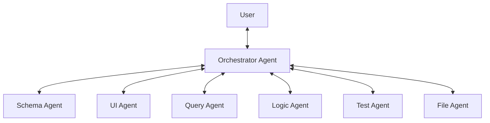

# Zenku — Build Your Data Apps via Conversation

> **Positioning:** AI-first Application Builder.
> The starting point is just a chat box, an empty database, and an empty folder. Users describe their needs in natural language, and the AI constructs and evolves the entire application from scratch.

---

## Core Vision

Zenku's goal is to break down technical barriers, allowing non-technical users to define data structures, design interfaces, and create automated workflows through "conversation" alone. The system does not just assist in data operations; it acts as the "primary builder" of the application, transforming user intent into functional software.

---

## Multi-Agent Architecture

Zenku adopts an **Orchestrator + Specialist Agents** architecture to achieve separation of concerns and precise control:

### 1. Orchestrator Agent
*   **Positioning**: The sole entry point for system interaction.
*   **Responsibility**: Analyzes intent, dispatches tasks to Specialist Agents, and integrates results to report back to the user.
*   **Principle**: Does not directly execute database or file operations; responsible only for coordination and routing.

### 2. Schema Agent
*   **Responsibility**: Handles data structure design, table creation (DDL), and migrations.
*   **Security**: Must pass impact assessments from the Test Agent before executing destructive changes (e.g., dropping columns).

### 3. UI Agent
*   **Responsibility**: Handles interface generation, menu organization, and layout design.
*   **Mechanism**: Combines pre-defined UI components (Building Blocks) to produce JSON definitions based on the schema; does not directly generate source code.

### 4. Query Agent
*   **Responsibility**: Answers data-related questions (e.g., "What was last month's revenue?", "Customer distribution?").
*   **Permissions**: Strictly restricted to read-only database access (SELECT only) to ensure security.

### 5. Logic Agent
*   **Responsibility**: Creates business rules, validation logic, and automated workflows (e.g., "Automatically mark orders over $10,000 as VIP").

### 6. Test Agent
*   **Responsibility**: Validates changes, assesses impact range, and ensures data integrity.

### 7. File Agent
*   **Responsibility**: Document parsing, OCR recognition, and file management. Can transform photos of paper contracts into structured data for table creation.

---

## Core Evolution Pattern

1.  **Creation**: "I want to manage customer data" → System creates tables, generates menus, and a basic list view.
2.  **Evolution**: "Customers should have tiers; highlight VIPs" → System modifies the Schema and updates the interface display.
3.  **Integration**: "Analyze new customer trends from last quarter" → System analyzes data and generates Dashboard charts.

---

## Key Design Decisions

### 1. Data-Driven UI
The interface is driven by **UI Component Definitions (JSON)** rather than directly generated source code. This ensures system stability, predictability, and easy cross-version upgrades.

### 2. Centralized Communication
Agents do not communicate directly; all messages must pass through the **Orchestrator**. This simplifies logic tracking and allows the Orchestrator to maintain a global state at all times.

### 3. Design Journal & Undo
The system records every design decision (reasoning, original requirement, Diff changes). This not only solves the AI's cross-session memory issue but also allows users to perform Undo operations by simply saying, "Go back to the previous version."

### 4. Permission & Context Isolation
Each Agent only has access to context related to its specific responsibility (e.g., the Query Agent cannot see UI definitions), improving Token efficiency and enhancing system security.
