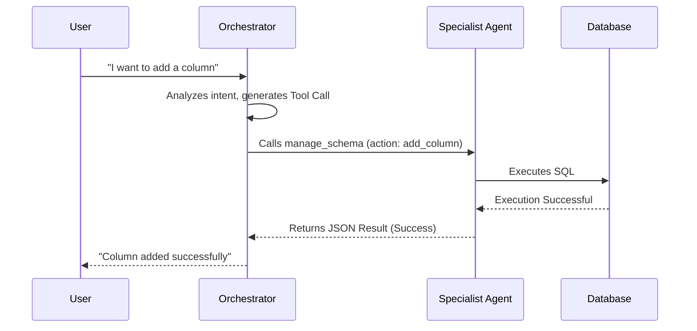

# Multi-Agent Architecture

> Zenku's core competitiveness lies in its unique agent collaboration model: the **Orchestrator (The Conductor)** is responsible for reasoning and decision-making, while the **Specialist Agents (Domain Executors)** handle precise execution.

---

## 1. Core Orchestrator
The `Orchestrator` is the system's sole "brain," located in `packages/server/src/orchestrator.ts`. It is the only component that interacts directly with the LLM (e.g., Claude, GPT).

### Core Responsibilities
*   **Intent Parsing**: Analyzes the user's natural language to determine which actions need to be performed (creating tables, modifying interfaces, querying data, etc.).
*   **Dynamic Context Injection**: Before every conversation, it automatically scans the current state of database Tables, Views, and Rules, injecting this information into the System Prompt.
*   **Tool Dispatching**: Based on the LLM's decision, it calls the corresponding Tools.
*   **Result Integration**: Consolidates the execution results (success or failure) from various agents back into the conversation flow to report to the user.

---

## 2. Specialist Agents
These agents are essentially **highly deterministic** execution logics. They do not communicate directly with the LLM; instead, they receive structured parameters (JSON) from the Orchestrator.

### List of Implemented Agents
*   **Schema Agent**: Responsible for DDL operations (`create_table`, `alter_table`).
*   **UI Agent**: Responsible for view definitions (`create_view`, `update_view`).
*   **Query Agent**: Executes read-only SQL queries (`query_data`).
*   **Logic Agent**: Manages business rules and trigger definitions.
*   **Test Agent**: Simulates the number of affected rows and views before executing destructive DDL (via the `assess_impact` tool).

---

## 3. Message Flow and Communication Pattern

### Centralized Communication
All messages must flow through the Orchestrator. Agents do not communicate with each other directly.

---

## 4. Prompt Engineering and Dynamic Instructions
The Orchestrator's System Prompt is dynamically composed of multiple modular instruction segments:
*   **Static Instructions**: Define basic behavioral principles and tool usage constraints for the Agent.
*   **Dynamic Context (`buildDynamicContext`)**: Real-time retrieval from the database of:
    *   The current list of tables.
    *   Existing interfaces and their source tables.
    *   Configured business rules.
    *   **Recent Operation Journal**: Used by the AI to understand the context of changes and perform Undo operations.

---

## 5. Permission Control Mechanism
The system dynamically filters available tools based on the user's role (`admin`, `builder`, `user`):
*   **Admin**: Can use all tools, including `undo_action`.
*   **Builder**: Can create and modify structures but cannot perform Undo.
*   **User**: Can only use `query_data` (read-only) and `write_data` (data mutation); cannot modify system structures.
