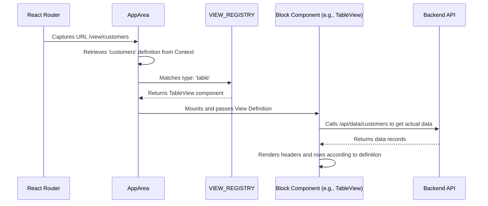

# Data-Driven UI Rendering

> Zenku is able to generate interfaces instantly after a conversation, and the core of this ability lies in its "Data-Driven" design. The frontend does not hard-code pages for specific business logic; instead, it acts as an interpreter for Metadata.

---

## 1. Core Components

The rendering mechanism is achieved through the collaboration of four core layers:

### A. Definition Layer (View Definition JSON)
Generated by the backend UI Agent and stored in the `_zenku_views` table. This JSON defines:
*   **View Type** (`type`): Such as `table`, `kanban`, `master-detail`, etc.
*   **Field Configuration** (`columns`, `fields`): Which fields to display, control types, sorting, etc.
*   **Interactions** (`actions`): Allowed Create, Delete, Edit, or Custom actions.

### B. State Layer (ViewsContext)
The React frontend retrieves all view definitions from the backend via `ViewsContext` during initialization. This ensures the frontend router can access the latest interface settings at any time.

### C. Dispatching Layer (AppArea.tsx)
Acts as the rendering "traffic hub," responsible for parsing the URL (e.g., `/view/:viewId`) and matching the corresponding React component from the `VIEW_REGISTRY` based on the `type` attribute in the View Definition.

### D. Block Component Layer (Universal Components)
Located in `packages/web/src/components/blocks/`, these components are highly abstracted and business-agnostic:
*   **`TableView`**: Uses `@tanstack/react-table` to dynamically generate headers and rows.
*   **`FormView`**: Iterates through field definitions to dynamically load corresponding Control components (e.g., `TextField`, `SelectField`, `RelationField`).
*   **`DashboardView`**: Parses `widgets` definitions and renders Recharts charts.

---

## 2. Rendering Lifecycle

---

## 3. Real-time Evaluation Engines

To ensure an excellent interactive experience, Zenku introduces two major engines at the rendering layer:

*   **Appearance Engine (`appearance.ts`)**:
    When a user inputs data into a form, the frontend evaluates rules in real-time to determine the status of other fields (e.g., Hidden/Visible, Read-only/Editable, Text Color) **without waiting for a backend response**.
*   **Relation Loading Engine (`RelationField.tsx`)**:
    When a field type is `relation`, the component automatically queries the backend for data from the related table, achieving automatic mapping of "Store ID, Display Name."

---

## 4. Supported View Types

Based on the current implementation, the system supports the following block components:
*   `table`: Standard CRUD list.
*   `master-detail`: Master-detail structure, supporting nested detail management.
*   `kanban`: Kanban mode, supporting status swimlanes.
*   `calendar`: Calendar view.
*   `dashboard`: Visual dashboard.
*   `timeline`, `gantt`, `tree`: Specialized data structure views.
*   `form-only`: Pure form mode, often used for custom actions.
