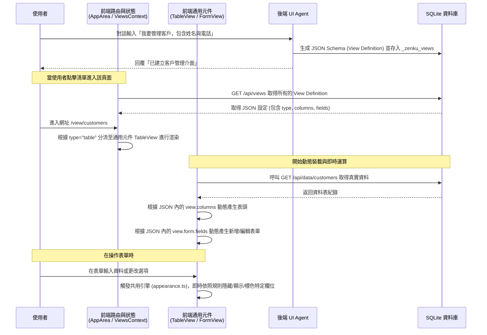
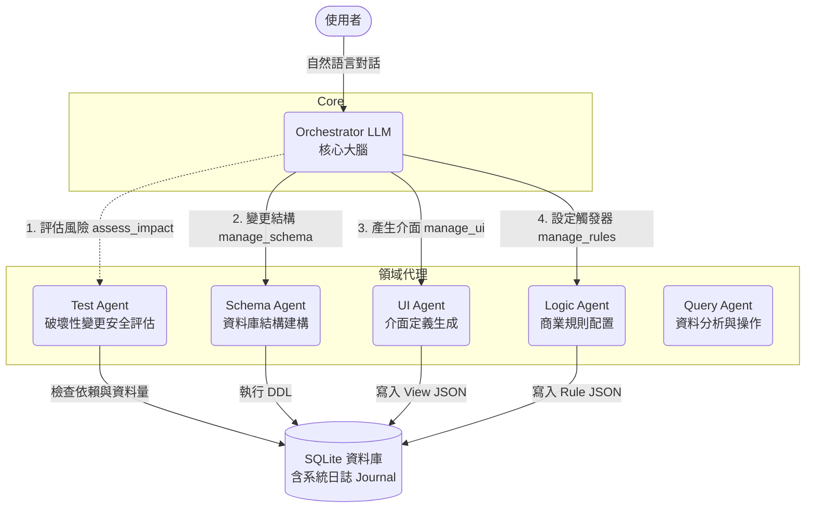

# Zenku 專案深度研究報告

## 1. 專案概述 (Project Overview)
Zenku 是一個由 AI 驅動的動態應用程式建構平台（類似 No-Code 系統或 ERP/CRM 產生器）。它的核心概念是讓使用者透過自然語言進行對話，系統背後的 AI Agent 會自動產生對應的資料庫綱要 (Schema)、使用者介面 (UI View) 以及商業邏輯規則 (Business Rules)，並實時渲染出功能完整的 Web 應用程式。

## 2. 系統架構 (System Architecture)
本專案採用 Monorepo 架構 (基於 npm workspaces)，主要分為三個 Package：

### `@zenku/server` (後端)
- **技術棧**：Node.js + Express + `node:sqlite`。
- **AI 整合**：支援多種 LLM Provider (`@anthropic-ai/sdk`, `openai`, `@google/generative-ai`)。
- **核心機制：多智能體協作架構 (Multi-Agent Architecture)**
  - **Orchestrator (`orchestrator.ts`)**：作為系統大腦，負責與使用者對話、解析需求，並調度底下的專職工具與 Agent 作為。
  - **專職 Agents**：包含 `schema-agent`（負責結構與建表）、`ui-agent`（負責介面設計）、`query-agent`（負責資料統計與查詢）、`logic-agent`（負責商業邏輯與自動化）以及 `test-agent`（負責結構變更的安全性評估）。
  - **核心 Tools**：AI 透過嚴謹定義的 JSON Schema 操作系統，例如 `manage_schema` (DDL 操作)、`manage_ui` (介面定義)、`write_data` (DML 操作)、`manage_rules` (觸發條件與動作) 等。

### `@zenku/web` (前端)
- **技術棧**：React 19 + Vite + Tailwind CSS + shadcn/ui + Radix UI。
- **動態渲染 (Data-Driven UI)**：前端沒有寫死的表單或列表頁面，而是透過讀取後端推送的 View Definition 動態生成。
- **UI 生態系**：
  - 表格：`@tanstack/react-table`
  - 視覺化圖表：`recharts` (長條圖、圓餅圖、折線圖等)
  - 看板拖曳：`@dnd-kit`

### `@zenku/shared` (共用程式碼)
- 前後端共用的 TypeScript 型別定義。
- `appearance.ts`：條件式 UI 的評估引擎（例如根據狀態隱藏欄位或變更顏色）。
- `formula.ts`：計算欄位（Computed Fields）的安全執行環境與邏輯。

## 3. 核心功能亮點 (Key Features)

1. **對話即開發 (Chat-to-App)**
   透過對話即可完成「建立資料表 → 產生 CRUD 介面 → 資料查詢」的完整迴圈。
   
2. **進階資料模型與關聯 (Relational Data & Master-Detail)**
   - 支援外鍵 (Foreign Key) 和關聯欄位 (`relation`)，能實現如下拉選單動態帶出關聯表資料。
   - 支援主檔-明細 (Master-Detail) 介面，例如「訂單及其底下的多筆訂單明細」的聚合管理。

3. **計算欄位與條件式 UI (Computed & Conditional UI)**
   - 包含靜態的 `$formula` 小計計算。
   - 實作了強大的 `appearance` 規則，能在客戶端即時判斷條件（如 `when { field: 'status', operator: 'eq', value: 'completed' }`），動態改變其他欄位的唯讀、隱藏、必填或文字顏色效果。

4. **商業規則引擎 (Logic / Rules Engine)**
   - 提供事件驅動的掛載點（如 `before_insert`, `after_update`），並交由資料庫觸發。
   - 可進行：欄位自動賦值、資料驗證拒絕、自動關聯更新（例如：採購單完成後批量更新庫存）、以及呼叫外部 Webhook (與 n8n 等流程軟體整合)。

5. **系統日誌與時光機 (Design Journal & Undo)**
   - 所有 Schema 或 View 的變更都會記錄到 `_zenku_journal` 表中。
   - 支援任意對話節點的回滾 (`undo_action`)，增強 AI 操作時的容錯性與可逆性。

6. **自訂介面動作 (Custom ViewActions)**
   - 能夠以按鈕形式掛載到列表 (Row) 或表單 (Record) 之中。
   - 支援行為包含：一鍵變更狀態 (`set_field`)、導航攜帶過濾參數 (`navigate`)、直接建立相關資料 (`create_related`) 或觸發 Webhook 等。

## 4. 發展 Roadmap 狀態分析

對照專案內的 `ROADMAP.md`，目前專案的進度相當完整，已經從單純的 PoC 通過多次架構升級：
- **已完成 (Phase 1 ~ Phase 6, Phase 8)**：
  - shadcn/ui 的全套導入與響應式佈局。
  - 前後端複雜資料模型的支援（Relation, Master-Detail）。
  - 對話歷史記錄、Agent 權限定義、視覺化報表（Dashboard/Kanban/Calendar）。
  - Webhook 整合以及多種 AI 供應商適配。
- **待發展 (Phase 7 等)**：
  - 更精細的使用者帳號體系與權限角色 (Role-based access controls)。
  - 可能的多租戶架構或向 PostgreSQL 的遷移以準備面對並行效能與更龐大的資料負載。

## 5. 動態 UI 渲染機制解析 (Dynamic UI Rendering Mechanism)
Zenku 能夠在對話後瞬間產生畫面，依賴的是「資料驅動 UI (Data-Driven / Metadata-Driven UI)」設計。前端程式碼（React）內並無針對特定業務（如訂單或客戶）寫死的頁面，而是扮演「解譯器」的角色：

### 渲染機制的核心組成大項 (Core Components)

整個動態渲染機制可以拆解為以下五個核心模組的協作：

1. **定義層 (View Definition JSON)**：
   由後端 UI Agent 根據使用者需求生成的元資料 (Metadata)，定義了頁面型態、欄位屬性、資料來源與條件規則，它是整個畫面的「建築藍圖」。
2. **狀態與快取層 (ViewsContext)**：
   前端的 React Context，負責在應用程式初始化或更新時，向後端取得所有的視圖配置清單並全域共享，確保設定檔的統一與避免頻繁的網路請求。
3. **路由與分發器 (AppArea)**：
   作為控制中樞，負責解析當下網址 URL (如 `/view/orders`)，找出對應的設定檔，並依據 `type` 屬性（如 `table`, `dashboard`, `kanban`）將渲染任務精準派發給合適的畫布元件。
4. **通用視圖模組 (Universal Block Components)**：
   包含了 `TableView`, `FormView`, `MasterDetailView` 等高度抽象的 React 元件。這些元件本身沒有寫死任何業務邏輯，而是接收上層傳來的 JSON Props 作為參數，利用如 `@tanstack/react-table` 等底層套件動態「變形」出真正的畫面結構。
5. **即時運算引擎 (Real-time Evaluation Engines)**：
   例如 `@zenku/shared/appearance.ts`（外觀條件判定）與 `formula.ts`（數學公式運算）。它們是從 UI 渲染層剝離出來的獨立邏輯模組，確保在使用者輸入資料的瞬間，畫面能夠立刻做出互動反應（如欄位變紅、隱藏），而無須依賴後端 API 的來回傳輸。

### 動態渲染流程圖

### 流程詳細解說

1. **AI 生成與儲存階段 (Schema Generation)**：
   使用者輸入自然語言後，後端 `UI Agent` 透過內部工具 `manage_ui` 將語意轉換為高度結構化的 JSON Schema (稱之為 View Definition)。這個設定檔內包含了：要顯示哪種排版 (table / dashboard / master-detail)、要有哪些欄位、連動下拉選單要對應哪個資料表來源，甚至包含了外觀切換的規則 (Appearance Rules)，最後存入後端系統的資料庫中。
   
2. **前端初始與路由分發階段 (Initialization & Routing)**：
   使用者進入網頁時，前端 React 透過全域狀態 `ViewsContext` 將所有的視圖設定載入記憶體。當導航至特定 URL (`/view/:viewId`) 時，分發器 `AppArea.tsx` 會將捕捉到的 ID 配對出對應的 JSON 設定檔。並依據當中的 `type` 屬性，決定將後續的渲染任務交給哪一個「通用的 Block 畫布元件」（例如：若是主從表單就交給 `MasterDetailView`）。

3. **動態裝載與即時運算階段 (Dynamic Rendering & Evaluation)**：
   被選中的通用元件一旦拿到 JSON，就會開始動態拼裝畫面：
   - **列表層 (`TableView`)**：結合 `@tanstack/react-table` 套件，遍歷 `view.columns` 動態定義表格並呼叫後端 API 取得真實資料。
   - **表單層 (`FormView`)**：遍歷 `view.form.fields`，依據各型別（`text`, `select`, `relation`）決定該放普通的輸入框、靜態下拉選單，或是會自動搜尋遠端資料的關聯選單。
   - **即時邏輯**：畫面運作的同時，會引入共用模組 `@zenku/shared/appearance.ts`。當使用者在畫面上敲擊或選擇任何內容，該引擎會即刻攔截狀態，判定 JSON 內所寫的條件邏輯，在不用重新讀取後端的情況下實現實時隱藏欄位、禁用欄位或改變字體顏色。

## 6. 多智能體與工具協作機制 (Multi-Agent & Tooling Collaboration)

Zenku 被定義為一個「多智能體 (Multi-Agent)」系統，但它的實作方式非常務實，它採用了**「中央樞紐 (Orchestrator)」搭配「領域執行器 (Domain Agents/Tools)」** 的協作模式：

### 代理協作架構圖

### 協作原理解析

在 `packages/server/src/agents/` 下，系統將不同職責劃分給不同的 Agent，它們具備以下協作特徵：

1. **唯一的大腦：Orchestrator (交響樂指揮家)**
   Orchestrator 是唯一負責與 LLM (如 Claude / GPT) 溝通的模組。每次對話前，它會將資料庫中現有的 Tables, Views, Rules 等系統狀態轉換為 System Prompt 告知 LLM。它決定了「要做什麼」，並且決定要呼叫什麼工具。
   
2. **確定性的執行器：Domain Agents**
   與一般全依賴 LLM 自行發揮的 Multi-Agent 不同，Zenku 中的 Schema Agent、UI Agent、Logic Agent 其實是**高度確定性 (Deterministic) 的 TypeScript 處理程序**。
   當 Orchestrator 決定產出特定的 JSON 視圖或修改特定欄位時，它會嚴格照著 `TOOLS` 的 `input_schema` 輸出參數。這些 Agents 收到參數後，負責執行實質的 SQLite DDL/DML 指令、攔截錯誤，並強制將每一個動作寫入 `_zenku_journal`，作為日後 Undo 復原的憑據。
   
3. **安全護欄：Test Agent**
   這是在修改既有系統時最重要的協作環節。當 Orchestrator LLM 主觀判定需要刪除或改名欄位時，依據系統設定，LLM 必須先呼叫 `assess_impact` 工具（也就是呼叫 `Test Agent`）。
   Test Agent 會進去資料庫掃描：
   - 該表目前有幾筆資料？
   - 有哪些 `Views` 或 `Rules` 正依賴這個欄位？
   - 哪些關聯表 (Foreign Keys) 會受影響？
   
   Test Agent 評估完後會回傳一份風險報告給 Orchestrator (例如：`"High Risk: 1500 rows affected..."`)，Orchestrator LLM 若發現風險過高，便會中斷操作反問使用者是否確定，從而徹底解決了 AI 誤刪除重要資料的盲點。

## 7. 總結 (Conclusion)
Zenku 是一個設計十分精巧且擴展性極強的系統。藉由將大語言模型 (LLM) 與確定性的工具函式庫 (Tools API) 結合，它有效避免了 LLM 寫純 Code 經常面臨的幻覺問題。專案內的模組邊界清晰，尤其是業務邏輯剝離到規則引擎，以及前端將呈現責任完全委託給 JSON Schema 的做法，充分展現了現代化 AI 原生應用程式該有的架構思維。

## 8. 系統規格與元資料字典 (System Specifications & Metadata Dictionary)

為了讓 AI 能精確生成與控制應用程式，Zenku 的底層採用了嚴謹的 Schema 字典。以下是從系統原始碼中盤點出來的各項設定細節清單：

### 8.1 視圖種類 (View Types)
不同於單一頁面，View definition 的 `type` 屬性決定了頁面的基礎佈局與互動模式：
- `table`：基礎的資料列表，包含 CRUD 與分頁搜尋功能。
- `master-detail`：主檔與明細表單（如：訂單主檔 + 訂單項目）。它會額外載入 `detail_views` 陣列，並以分頁 (Tab) 形式渲染在主檔表單下方。
- `dashboard`：圖表儀表板。不依賴傳統欄位，而是由多個 `widgets`（如 `stat_card`, `bar_chart`, `pie_chart` 等）模塊組成，組裝各種 SQL 數據呈現。
- `kanban`：看板模式。需要指定包含選項的 `group_field`（用來做泳道分組）以及用來顯示大標題的 `title_field`。
- `calendar`：行事曆模式。需要設定 `date_field` 與 `title_field` 來將資料標定於月曆上。

### 8.2 資料庫實體欄位型態 (DB Schema Types)
Schema Agent 在操作底層 SQL 資料庫時，接受的欄位類型主要有：
- `TEXT`：字串 / 長文本
- `INTEGER`：整數 / 布林值底層 / 外部關聯鍵 (References Foreign Key)
- `REAL`：浮點數 / 小數 / 貨幣金額
- `BOOLEAN`：布林值
- `DATE` / `DATETIME`：日期與時間

### 8.3 前端表單控制項 (Form Control Types)
UI Agent 定義畫面時，透過 `.form.fields` 的 `type` 決定真實渲染的 React 元件：
- **基礎輸入**：`text`, `number`, `boolean`, `date`, `textarea`。
- **特定格式輸入**：`currency` (自動補千分位與格式化), `phone`, `email`, `url`。
- **選項選單類**：
  - `select`：下拉選單。可以是靜態 `options` 寫死，也可以配置 `source` 動態取自其他表單的資料。
  - `relation`：關聯選單。專門用來選取 Foreign Key 資料，具備自動背景搜尋遠端資料表、儲存 `value_field` (如 ID) 並顯示 `display_field` (如 Name) 的強大功能。
  - `enum`：帶有特殊樣式或 Badge 的狀態列舉選單。

### 8.4 商業規則的觸發時機 (Rule Trigger Types)
Logic Agent 管理的商業規則緊密扣合資料生命週期的鉤子 (Hooks)：
- **資料更動前 (Before)**：`before_insert`, `before_update`, `before_delete`。通常用來做條件阻擋（Validation）或資料儲存前的自動計算與強制賦值。
- **資料更動後 (After)**：`after_insert`, `after_update`, `after_delete`。通常用來引發系統副作用，例如產生通知、寫入紀錄到另一張表、發送 External Webhook。
- **手動觸發 (Manual)**：`manual`。這可由前端自訂動作按鈕 (Custom ViewAction) 以按下按鈕的方式主動觸發流程。

### 8.5 商業規則的動作種類 (Rule Action Types)
觸發規則後可執行的動作陣列 (Actions) 支援：
- `set_field`：自動覆寫某個欄位的值（且支援帶入運算公式，如 `total * 0.9`）。
- `validate`：資料驗證。如條件不符時中斷當下操作，並向前端拋出設定好的 `message` 錯誤訊息字串。
- `create_record`：在指定的另一張表自動新建一筆資料。
- `update_record`：條件性更新關聯表中的特定「單筆」資料。
- `update_related_records`：批次更新關聯資料。例如出貨單新增完成後，透過明細項目表 (`via_table`) 批次連動去扣抵庫存表的商品數量。
- `webhook`：發送 HTTP API (包含帶有資料 Payload 的 GET/POST) 到外部系統 (例如觸發企業內部的 n8n 協作流程)。
- `notify`：推播或發送站內/外部文字訊息 (`text`)。

### 8.6 條件化顯示 (Conditional Appearance) 細項
決定畫面要即刻變動的 `appearance` 判定陣列，會由 `@zenku/shared/appearance.ts` 引擎在使用者改變畫面的剎那執行：

**支援即時判斷的運算符 (Operators)**：
- **數值與字串比對**：`eq` (等於), `neq` (不等於)
- **數值區間比對**：`gt` (>), `lt` (<), `gte` (>=), `lte` (<=)
- **文字包含**：`contains`
- 本引擎支援將上述運算進行 `logic: 'and' | 'or'` 的複合邏輯樹串聯。

**條件滿足時可以疊加生效的外觀屬性 (Apply Effects)**：
- `visibility`： `hidden` 讓欄位憑空消失；或預設隱藏時透過 `visible` 讓條件滿足後才冒出來。
- `enabled`： 設定為 `false` 即可將輸入框鎖死變為唯讀 (Read-only)/禁用 (Disabled)。
- `required`： 設定為 `true` 即可依照情境動態要求此欄位必須填寫。
- `text_color` / `bg_color`： 賦予 CSS 顏色碼（如 `#dc2626` 或 `green`）動態改變字體與警告背景顏色。
- `font_weight`： 切換粗體 `bold` 或正常 `normal` 達到凸顯效果。

## 9. AI 代理工具集 (MCP Tools / Orchestrator Tools)

Zenku 的 Orchestrator (核心 LLM) 是透過一系列精確定義的工具 (Tools) 進行操作。這些工具就如同 Model Context Protocol (MCP) 中提供給大模型呼叫的 Function Calling 端點。系統目前開放給 AI 的核心工具有：

1. **`manage_schema`**
   - **職責**：管理底層資料庫的 Table DDL。
   - **操作內容**：執行 `create_table` 建立新資料表，或 `alter_table` 新增欄位，甚至進行破壞性更新。它會呼叫 `Schema Agent` 確實執行 SQL 修改。
2. **`manage_ui`**
   - **職責**：建立與更新前端的視圖介面。
   - **操作內容**：包含 `create_view`、`update_view` 與 `get_view` 三個動作。AI 透過此工具註冊 `View Definition JSON` 到存儲空間中。特別的是，為了避免覆蓋遺失已設定好的欄位，系統強制要求 AI 在進行 `update_view` 前，必須先呼叫 `get_view` 取回完整的視圖 JSON，再完整送回修改後的版本。
3. **`manage_rules`**
   - **職責**：配置無代碼自動化與業務邏輯。
   - **操作內容**：設定 `trigger_type` (如 `before_insert`) 與 `actions` (如驗證、發送 webhook、連動更新庫存)，呼叫 `Logic Agent` 產生規則腳本。
4. **`query_data`**
   - **職責**：回答圖表或統計問題。
   - **操作內容**：僅允許執行 `SELECT` 語句，查詢真實資料內容以回覆給使用者（由 `Query Agent` 處理）。
5. **`write_data`**
   - **職責**：直接讀寫或修改真實業務資料。
   - **操作內容**：當使用者要求「幫我新增一筆訂單」時，代理會繞過 UI 介面，直接透過此工具使用 `insert` / `update` / `delete` 來異動資料表內容。
6. **`assess_impact`**
   - **職責**：破壞性動作前的安全演習。
   - **操作內容**：每當 AI 要執行 `drop_column` 或 `drop_table` 等危險操作，強制觸發呼叫 `Test Agent` 進行模擬。分析出受牽連的行數、受到破壞的 Views 與 Rules，作為風險警語回傳給大腦再次確認。
7. **`undo_action`**
   - **職責**：時光回溯的關鍵介面。
   - **操作內容**：利用 `_zenku_journal` 中紀載的反向 SQL 及 JSON Diff，執行單步倒退 (`target: 'last'`)、或批次倒退至特定時間點。

## 10. 系統層與狀態觀測 (System Meta-Storage & Tracing)

在你剛才提問後，我進一步查閱了專案中負責掌管資料庫的 `db.ts`，發現了一塊前面未曾著墨、但非常重要的架構，那就是 **Zenku 「如何強健地記憶自我」以及「如何觀測 AI 模型狀態」**。

系統在 SQLite 資料庫中除了建立客戶的業務資料表外，還巧妙地維護了三組以 `_zenku_` 開頭的核心系統表：

### 10.1 應用層狀態表 (Core Metadata Tables)
- **`_zenku_views`**：用來儲存前端 `manage_ui` 產生的視圖定義，前端正是依靠這張表動態組裝頁面。
- **`_zenku_rules`**：儲存所有的商業邏輯觸發條件與動作，由後端引擎嚴格監聽資料表的生命週期來執行它。
- **`_zenku_journal` (時光機日誌)**：裡面不只紀錄 AI 做了什麼變更，最核心的是它會紀錄 `reversible` (是否可逆) 以及備妥 `reverse_operations` (反向還原 SQL)。這也是 `undo_action` 工具能夠進行單步退回或時光倒流的技術基石。

### 10.2 AI 觀測與成本追蹤系統 (AI Observability & Tracing)
專案不僅是個 Low-Code 引擎，它更自帶了類似 **LangSmith 或 Helicone 的本地端 AI 監控設施**：
- **`_zenku_chat_sessions`**：記錄使用者的每個對話房間，並在背後精準計算該房間消耗的 `total_input_tokens`, `total_output_tokens`, `total_thinking_tokens` 甚至是匯總的金額 `total_cost_usd`。
- **`_zenku_chat_messages`**：記錄每句對話的歷史，並且追蹤推論延遲時間 `latency_ms`。
- **`_zenku_tool_events`**：詳細記錄 AI 歷次呼叫工具時輸入了什麼 JSON (`tool_input`)、得到了什麼結果 (`tool_output`) 以及執行成功與否。這對於 Debug 多智能體協作時的幻覺糾錯幫助極大。

### 10.3 認證與帳號體系 (Authentication & RBAC)
- **`_zenku_users` 與 `_zenku_sessions`**：包含角色體系 (`admin` / `builder` / `user`)，能區分誰是可以建構系統的 Builder，誰只是純粹登入使用操作介面的 User。

這個系統將配置、日誌、AI 花費觀測全部集中封裝在一起，是十分完整的 AI 產品級設計！

## 11. 資料庫綱要生命週期與遷移策略 (DB Schema Lifecycle & Migration Strategy)

對於未來要將系統骨架進行遷移（例如：從開發測試環境部署到正式生產區），理解 Zenku 建立資料庫表結構 (Table Schema) 的時機點至關重要。Zenku 的資料表生成分為兩大截然不同的階段：

### 11.1 系統核心資料表 (`_zenku_*`)：Lazy Initialization (延遲初始化)
**建立時機：伺服器啟動後第一次存取資料庫時**
- 在 `@zenku/server` 內的 `src/db.ts` 中採用了 Singleton 單例模式的 `getDb()`。
- 無論是前端首次請求畫面 (`/api/views`)，還是使用者準備開始對話，只要系統**第一次呼叫到 `getDb()`**，系統就會自動執行 `initSystemTables()`。
- 該函式會透過原生的 `CREATE TABLE IF NOT EXISTS` 語法，瞬間在 SQLite 中把所有系統運作所需的底層表（如 `_zenku_views`, `_zenku_rules`, `_zenku_journal`, `_zenku_chat_sessions` 等）全部建構好。
- **遷移影響**：因此在遷移測試區至正式區時，**您永遠不需要手動建立這些系統表**，只要後端服務一啟動，它就會自我修復與部署基礎建設。

### 11.2 客戶業務資料表 (如 `customers`, `orders`)：Dynamic Runtime (動態運行時生成)
**建立時機：AI 對話過程的「當下」**
有別於傳統開發需由工程師撰寫 Prisma 或 TypeORM 的 Migration 腳本並在掛載前執行，Zenku 透過 AI Agent 來完成這件事：
1. 當使用者送出語意需求（如：「*幫我建立訂單與客戶關聯表*」）。
2. Orchestrator 大腦判斷意圖後，呼叫 `manage_schema` 工具產生 JSON 定義（如 `action: "create_table"`）。
3. 系統的 `SchemaAgent` 收到定義後，會**立刻在當下**組裝並執行 SQLite 的 `CREATE TABLE` 與 `ALTER TABLE` 語法。
4. SchemaAgent 執行並留下可回滾的 Journal 變更紀錄後，再由 AI 回覆前端「已建立完成」。

**遷移與部署策略的啟發**：
- **不需 Migration 腳本**：Zenku 是一個沒有 `migrations` 資料夾的專案。它的 Schema 變化是活的。
- **搬遷骨架的做法**：如果你在測試區 (Staging) 透過對話建構了極為複雜的 ERP 架構（包含了各種 `_zenku_views` 視圖和大量的客戶業務資料表）。要遷移到正式區 (Production) 時，最原生的做法**就是直接複製並替換那份 `zenku.db` 檔案**（或是保留表結構、手動清空業務表的資料）。因為 UI、商業邏輯、甚至是未來表結構的長相，已經100% 綁定在那個 SQLite 檔案裡面的狀態表中了。
