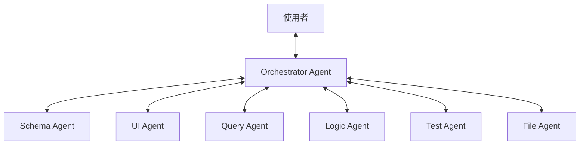

# Zenku（禪空）— 用對話建立你的資料應用

> **定位：** AI-first Application Builder。
> 起點只有一個對話框、空白資料庫與空白資料夾。使用者透過自然語言描述需求，AI 從零開始建構並演化整個應用。

---

## 核心願景

Zenku 的目標是打破技術門檻，讓非技術使用者能夠僅透過「對話」來定義資料結構、設計介面並建立自動化流程。系統不僅僅是協助操作資料，而是作為應用程式的「主體建構者」，將使用者的意圖轉化為可運作的軟體。

---

## 多代理協作架構 (Multi-Agent Architecture)

Zenku 採用 **Orchestrator + Specialist Agents** 的架構，實現職責分離與精準控制：

### 1. Orchestrator Agent (調度者)
*   **定位**：系統對話的唯一入口。
*   **職責**：判斷意圖，將任務分派給專職代理（Specialist Agents），並整合結果回報給使用者。
*   **原則**：不直接執行資料庫或檔案操作，僅負責協調與路由。

### 2. Schema Agent (結構代理)
*   **職責**：負責資料結構設計、資料表建立（DDL）與遷移。
*   **安全性**：在執行破壞性變更（如刪除欄位）前，必須通過 Test Agent 的影響評估。

### 3. UI Agent (介面代理)
*   **職責**：負責畫面生成、選單組織與佈局設計。
*   **機制**：根據 Schema 產出的結構，組合預定義的 UI 元件（Building Blocks）產出 JSON 定義，不直接生成程式碼。

### 4. Query Agent (查詢代理)
*   **職責**：回答資料相關問題（如「上月營收？」、「客戶分布？」）。
*   **權限**：嚴格限制為資料庫唯讀（SELECT only），確保安全性。

### 5. Logic Agent (邏輯代理)
*   **職責**：建立業務規則、驗證邏輯與自動化流程（如「訂單金額超過一萬自動標記為 VIP」）。

### 6. Test Agent (測試代理)
*   **職責**：驗證變更、評估影響範圍（Impact Assessment）並確保資料完整性。

### 7. File Agent (檔案代理)
*   **職責**：文件解析、OCR 識別與檔案管理。可將紙本合約截圖轉化為結構化資料供建表使用。

---

## 核心演進模式

1.  **初創**：「我要管理客戶資料」→ 系統建表、生成選單與基礎清單畫面。
2.  **演化**：「客戶要有分級，VIP 要特別標記」→ 系統修改 Schema 並更新介面顯示。
3.  **整合**：「分析上季新增客戶趨勢」→ 系統分析資料並生成 Dashboard 圖表。

---

## 關鍵設計決策 (Key Design Decisions)

### 1. 資料驅動介面 (Data-Driven UI)
介面是由 **UI 元件定義 (JSON)** 驅動，而非直接生成原始程式碼。這確保了系統的穩定性、可預測性，並能輕鬆進行跨版本升級。

### 2. 集中式通訊 (Centralized Communication)
所有 Agent 之間不直接溝通，必須透過 **Orchestrator** 進行訊息傳遞。這簡化了邏輯追蹤，並讓 Orchestrator 能隨時掌握全局狀態。

### 3. 設計日誌與回滾 (Design Journal & Undo)
系統紀錄每一項設計決策（原因、原始需求、Diff 變化）。這不僅解決了 AI 的跨對話記憶問題，更讓使用者能隨時說出「回到剛才的版本」來進行 Undo 操作。

### 4. 權限與上下文隔離 (Context Isolation)
每個 Agent 僅能接觸其職責相關的上下文（如 Query Agent 看不到 UI 定義），提升了 Token 使用效率並加強了系統安全性。
