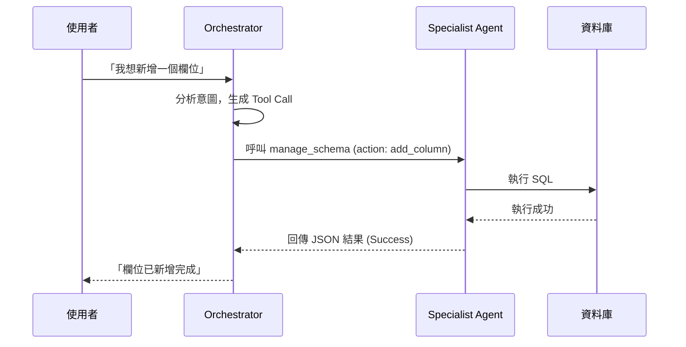

# 多智能體協作架構 (Multi-Agent Architecture)

> Zenku 的核心競爭力在於其獨特的代理協作模式：**Orchestrator（交響樂指揮家）** 負責思考與決策，而 **Specialist Agents（領域執行器）** 負責精確執行。

---

## 1. 核心調度者：Orchestrator
`Orchestrator` 是系統唯一的「大腦」，位於 `packages/server/src/orchestrator.ts`。它是唯一與 LLM (如 Claude, GPT) 進行直接對話的組件。

### 核心職責
*   **意圖解析**：解析使用者的自然語言，判斷需要執行哪些動作（建表、改介面、查資料等）。
*   **動態上下文注入**：在每次對話前，自動掃描資料庫目前的 Table, View, Rules 狀態，並將其注入 System Prompt 中。
*   **工具調度**：根據 LLM 的決定，呼叫對應的工具 (Tools)。
*   **結果整合**：將各個 Agent 執行後的結果（無論成功或失敗）整合回對話流，回報給使用者。

---

## 2. 領域代理 (Specialist Agents)
這些 Agent 本質上是**高度確定性 (Deterministic)** 的執行邏輯。它們不直接與 LLM 對話，而是接收來自 Orchestrator 的結構化參數（JSON）。

### 目前實作的 Agent 列表
*   **Schema Agent**：負責 DDL 操作 (`create_table`, `alter_table`)。
*   **UI Agent**：負責視圖定義 (`create_view`, `update_view`)。
*   **Query Agent**：執行唯讀 SQL 查詢 (`query_data`)。
*   **Logic Agent**：管理商業規則與觸發器定義。
*   **Test Agent**：在執行破壞性 DDL 前，模擬受影響的資料列與 View 數量（透過 `assess_impact` 工具）。

---

## 3. 訊息流與通訊模式 (Message Flow)

### 中心化通訊
所有訊息必須流經 Orchestrator。Agent 之間互不通訊。

---

## 4. Prompt 工程與動態指令
Orchestrator 的 System Prompt 是由多個模組化指令動態組合而成：
*   **靜態指令**：定義 Agent 的基本行為原則與工具使用限制。
*   **動態上下文 (`buildDynamicContext`)**：即時從資料庫取得：
    *   目前的資料表清單。
    *   現有的介面名稱及其來源表。
    *   已設定的商業規則。
    *   **近期操作日誌 (Journal)**：用於 AI 理解變更脈絡與執行 Undo。

---

## 5. 權限管控機制
系統會根據使用者的角色 (`admin`, `builder`, `user`) 動態過濾可用的工具：
*   **Admin**：可使用所有工具，包含 `undo_action`。
*   **Builder**：可建立與修改結構，但無法執行 Undo。
*   **User**：僅能使用 `query_data` (唯讀查詢) 與 `write_data` (資料異動)，無法改動系統結構。
