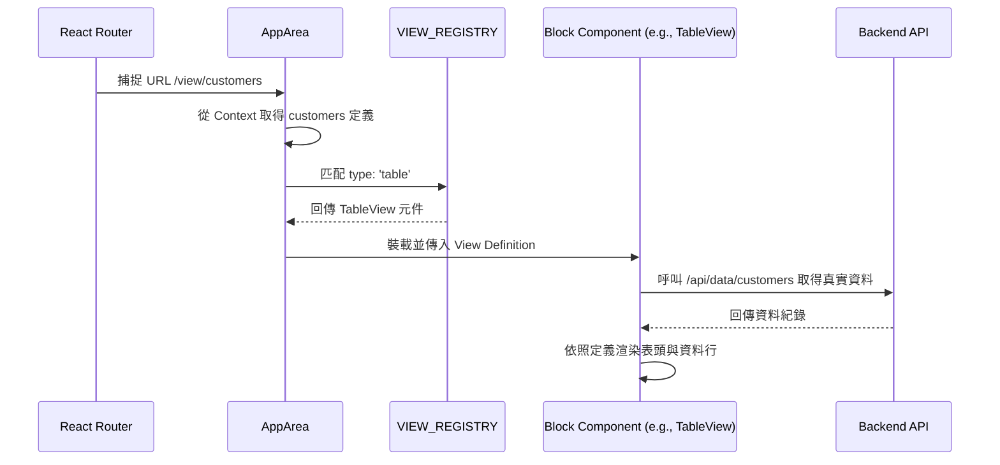

# 資料驅動 UI 渲染機制 (Data-Driven UI Rendering)

> Zenku 能夠在對話後瞬間產生畫面，核心在於其「資料驅動」的設計。前端不針對特定業務寫死頁面，而是扮演 Metadata 的解譯器。

---

## 1. 核心組成大項

整個渲染機制由以下四個核心層次協作完成：

### A. 定義層 (View Definition JSON)
由後端 UI Agent 生成並儲存在 `_zenku_views` 表中。這份 JSON 定義了：
*   **視圖型態** (`type`)：如 `table`, `kanban`, `master-detail` 等。
*   **欄位配置** (`columns`, `fields`)：要顯示哪些欄位、控制項型態、排序等。
*   **交互動作** (`actions`)：允許的新增、刪除、編輯或自訂動作。

### B. 狀態層 (ViewsContext)
前端 React 會在初始化時，透過 `ViewsContext` 向後端取得所有視圖定義。這確保了前端路由隨時能獲取最新的介面設定。

### C. 分發層 (AppArea.tsx)
作為渲染的「交通樞紐」，負責解析網址 URL (如 `/view/:viewId`)，並依據 View Definition 的 `type` 屬性，從 `VIEW_REGISTRY` 中找出對應的 React 元件。

### D. 畫布元件層 (Universal Block Components)
位於 `packages/web/src/components/blocks/`，這些元件高度抽象且業務無關：
*   **`TableView`**：利用 `@tanstack/react-table` 動態生成表頭與資料列。
*   **`FormView`**：遍歷欄位定義，動態裝載對應的 Control 元件（如 `TextField`, `SelectField`, `RelationField`）。
*   **`DashboardView`**：解析 `widgets` 定義並渲染 Recharts 圖表。

---

## 2. 渲染流程圖 (Rendering Lifecycle)

---

## 3. 即時運算引擎 (Real-time Evaluation)

為了保證極致的交互體驗，Zenku 在渲染層引入了兩大引擎：

*   **外觀規則引擎 (`appearance.ts`)**：
    當使用者在表單輸入資料時，前端會即時根據規則判定其他欄位的「隱藏/顯示」、「唯讀/編輯」、「文字顏色」等狀態，**完全無需等待後端回傳**。
*   **關聯載入引擎 (`RelationField.tsx`)**：
    當欄位型態為 `relation` 時，元件會自動向後端查詢關聯表的資料，並實現「存取 ID、顯示名稱」的自動對接。

---

## 4. 支援的視圖型態 (Supported View Types)

根據現有實作，系統支援以下畫布元件：
*   `table`：標準 CRUD 列表。
*   `master-detail`：主從表結構，支援巢狀明細管理。
*   `kanban`：看板模式，支援狀態泳道。
*   `calendar`：月曆視圖。
*   `dashboard`：視覺化儀表板。
*   `timeline`, `gantt`, `tree`：專業資料結構視圖。
*   `form-only`：純表單模式，常用於自定義動作。
